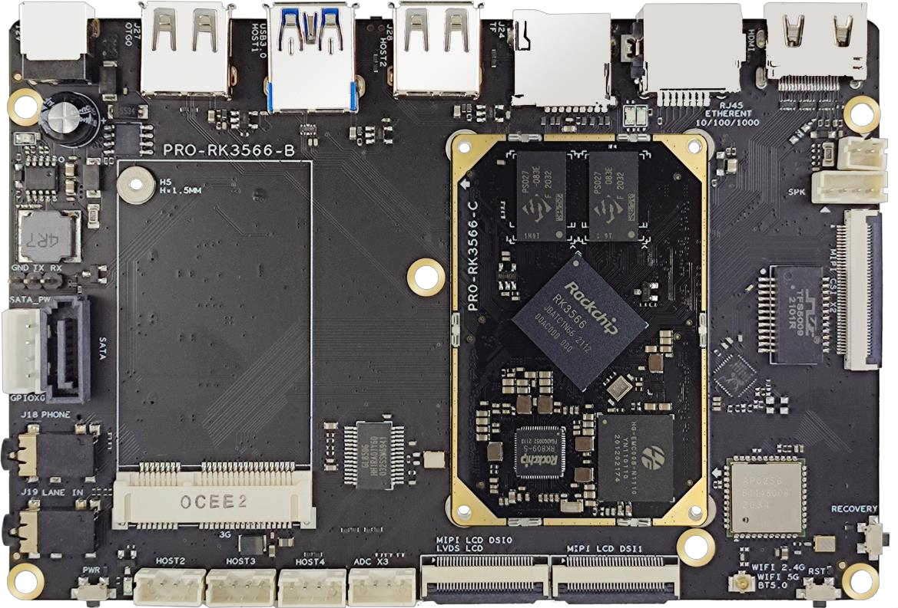
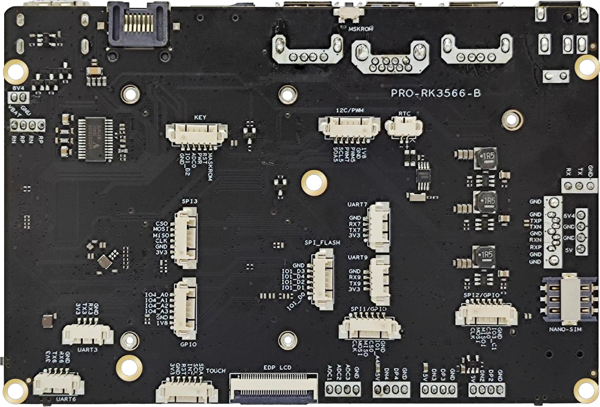
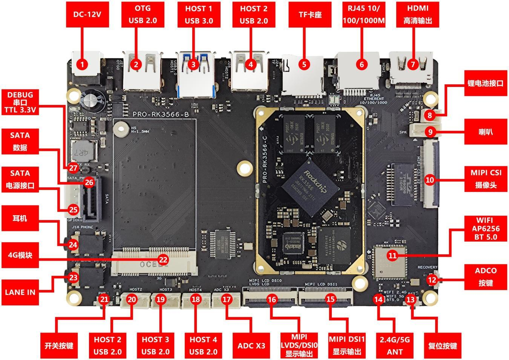
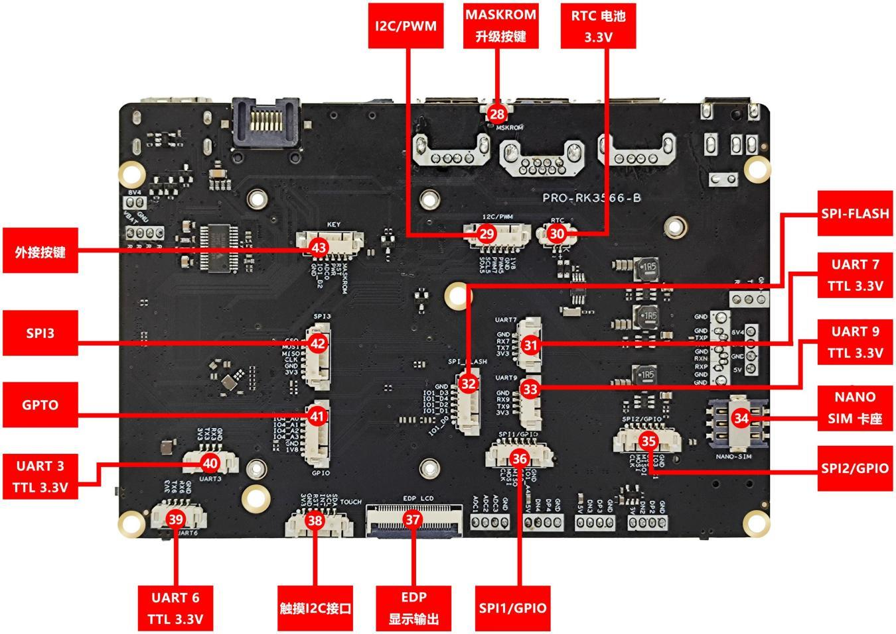
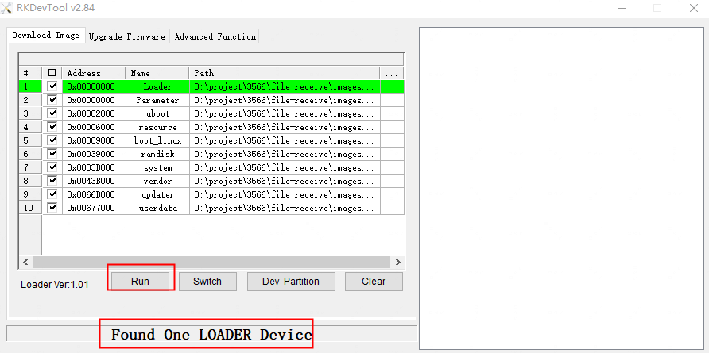
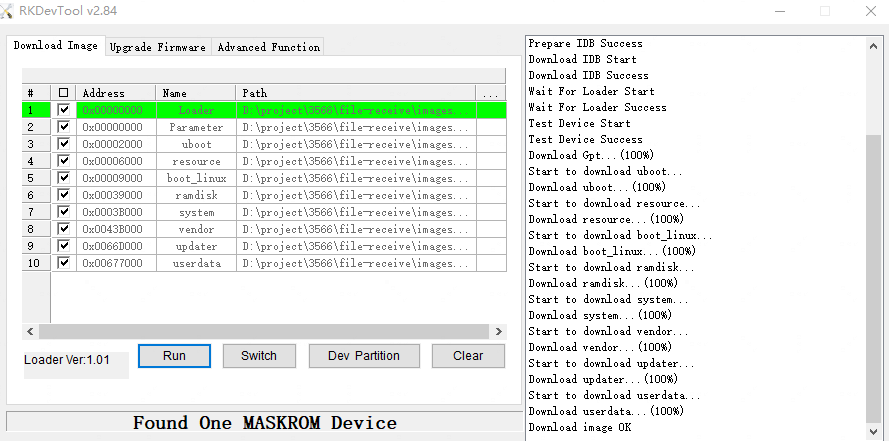
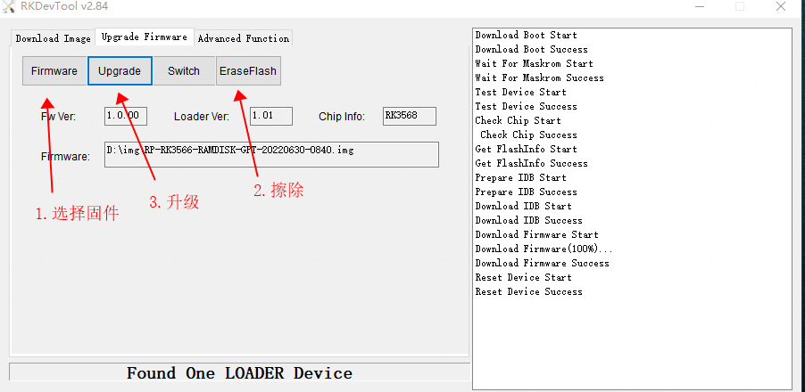

# 【开发板名称】深开鸿【金星】系列智慧屏khdvk-3566b开发套件

### **简介**

深开鸿khdvk-3566b采用ROCKCHIP RK3566 Cortex-A55 四核处理器，支持应用场景深度定制的高性能开发平台，为技术设计到产品化过程提供快速高效的开发通道。提供多路通用显示屏接口，接口类型丰富，支持外设拓展，满足多种人机交互场景的需求，适用于平板电脑，学习机，人脸别相关，主要产品有匝机通道，刷脸支付，工业机器人，医疗检测设备，车牌识别，广告机、数字标牌、智能自助终端、智能零售终端等相关产品。

### 一 、开发板详情

#### 1.基本功能列表

|          |                         主要硬件指标                         |
| :------: | :----------------------------------------------------------: |
|   尺寸   |                  135mm长*90mm宽*14mm高                    |
| 连接方式 |                   板对板连接设计（核心板）                   |
|   CPU    |                  ROCKCHIP RK3566 四 核 A55                   |
|   GPU    | ARM Mali-G52 2EE 兼容 OpenGL ES 1.1/2.0/3.2、 OpenCL 2.0 和 Vulkan 1.1 内嵌高性能 2D 加速硬件 |
|   NPU    |      0.8TOPs，支持TensorFlow/Caffe 等主流架构模型的转换      |
|   内存   |                    DDR4 标配 4GB 选配 2GB                    |
|  存储器  |             EMMC 5.1 标配 32GB 选配 8GB/16G/64G              |
| 工作电压 |                        12V 1.5A 以上                         |
| 支持系统 |                          KaihongOS                           |
| 工作温度 |                          -10℃～ 60℃                          |
| 存储温度 |                          -30℃～ 70℃                          |


|                |                    主板常用接口                     |
| :------------: | :-------------------------------------------------: |
|  USB HOST2.0   | 5 路 USB， 2 路外接标准 USB 其中一路 OTG， 3 路内接 |
|  USB HOST3.0   |              1 路外接标准 USB 3.0 接口              |
|      串口      |           5 路 TTL 串口，其中一路为 DEBUG           |
|   HDMI 显示    |                    1 路 HDMI 2.0                    |
|    EDP 显示    |            支持 EDP 显示输出 最高 1080P             |
|   LVDS 显示    |        支持单路 LVDS 显示输出 最高 1280x800         |
| MIPI DSI 显 示 |              2 路 DSI 显示输出 最高 2K              |
| MIPI CSI 输 入 |              2 路 CSI MIPI 摄像头接口               |
|     以太网     |                 1 路 10M/100M/1000M                 |
|    语音输出    |     1 路耳机左右声道输出，二路喇叭输出 5W/8 欧      |
|    语音输入    |                  1 路 LANE IN 输入                  |
|      SATA      |                    SATA 硬盘接口                    |
|     TF 卡      |                 TF 卡接口最大 128G                  |
|      WIFI      |              AP6256 2.4G/5G 双 频 WIFI              |
|      蓝牙      |                AP6256 2.4G 蓝 牙 5.0                |
|      SPI       |                    3 路 SPI 接口                    |
|      I2C       |                    2 路 I2C 接口                    |
|      PDM       |                  4 路 PDM 硅麦接口                  |
|      GPIO      |                 6 路独立 GPIO 接口                  |
|      GPS       |                  外置 GPS（可选）                   |
|      ADC       |                    3 路 ADC 输入                    |
|    数据通信    |                  4G 功能， 4G 上网                  |
|  RTC 实时时钟  |        HYM8563 外置纽扣电池支持掉电时间保存         |


#### 2.主板展示图  






#### 3.接口标识图  






在组装使用过程中，请注意下面（且不限于）问题点：

➢ 裸板与外设短路问题。

➢ 在安装固定过程中，避免裸板因固定原因而造成变形问题。

➢ 安装 MIPI/LVDS 屏时，注意屏电压，电流是否符合。注意屏座子第 1 脚方向问题。

➢ 安装双路 LVDS 屏时，注意屏背光电压，电流是否符合。屏背光的功率在 20W 以上的话，是否使用其
他电源板供电。

➢ 外设（USB， IO .UART）安装时，注意外设 IO 电平和电流输出问题。

➢ 串口安装时，注意不能直连 RS232,RS485 设备。 TX,RX 接法是否正确。

➢ 输入电源是否接入在电源输入接口上，根据总外设评估，输入电源电压，电流等是否满足要求。杜绝为
了方便操作从背光插座进行接入供电输入电源  

### **二、搭建开发环境**

#### **1、安装依赖包**

安装命令如下：

```
sudo apt-get update && sudo apt-get install binutils git git-lfs gnupg flex bison gperf build-essential zip curl zlib1g-dev gcc-multilib g++-multilib libc6-dev-i386 lib32ncurses5-dev x11proto-core-dev libx11-dev lib32z1-dev ruby ccache libgl1-mesa-dev libxml2-utils xsltproc unzip m4 bc gnutls-bin python3-pip
```

```
sudo apt-get install device-tree-compiler
sudo apt-get install libssl-dev
sudo apt install libtinfo5
sudo apt install openjdk-11-jdk
sudo apt-get install liblz4-tool
pip3 install dataclasses
```

**说明：** 
以上安装命令适用于Ubuntu18.04，其他版本请根据安装包名称采用对应的安装命令。

#### **2、获取标准系统源码**

**前提条件**

1）注册码云 gitee 账号。（https://gitee.com/signup）

2）注册码云SSH公钥，请参考[码云帮助中心](https://gitee.com/help/articles/4191)。

3）安装[git客户端](http://git-scm.com/book/zh/v2/%E8%B5%B7%E6%AD%A5-%E5%AE%89%E8%A3%85-Git)和[git-lfs](https://gitee.com/vcs-all-in-one/git-lfs?_from=gitee_search#downloading)并配置用户信息。

```
git config --global user.name "yourname"

git config --global user.email "your-email-address"

git config --global credential.helper store
```

4）安装码云repo工具，可以执行如下命令。

```
#如果没有权限，可下载至其他目录，并将其配置到环境变量中

curl -s https://gitee.com/oschina/repo/raw/fork_flow/repo-py3 > /usr/local/bin/repo 

chmod a+x /usr/local/bin/repo

pip3 install -i https://repo.huaweicloud.com/repository/pypi/simple requests
```

**获取源码**

1） 通过repo + ssh 下载（需注册公钥，请参考[码云帮助中心](https://gitee.com/help/articles/4191)）。

```
repo init -u ssh://git@gitlab.kaihongdigi.com:3333/OpenHarmony_3566B/manifest.git -b master -m  khdvk-3566b-weekly0607.xml --no-repo-verify
```

2） 通过repo + https 下载。

```
repo init -u http://gitlab.kaihongdigi.com:9010/OpenHarmony_3566B/manifest.git -b master -m  khdvk-3566b-weekly0607.xml --no-repo-verify
```

3）之后统一执行如下命令

```
repo sync -c

repo forall -c 'git lfs pull'
```

**执行prebuilts**

在源码根目录下执行脚本，安装编译器及二进制工具。

```
bash build/prebuilts_download.sh
```

下载的prebuilts二进制默认存放在与OpenHarmony同目录下的OpenHarmony_2.0_canary_prebuilts下。

### **三、编译调试**

#### **1、编译**

在Linux环境进行如下操作:

1） 进入源码根目录，执行如下命令进行版本编译。

```
./build.sh --product-name khdvk-3566b
```

2） 检查编译结果。编译完成后，log中显示如下：

```
[OHOS INFO] khdvk-3566b build success
[OHOS INFO] cost time: 1:20:00
=====build  successful=====
2022-07-04 13:41:54
```

编译所生成的文件都归档在out/khdvk-3566b/目录下，结果镜像输出在
out/khdvk-3566b/packages/phone/images/ 目录下。

3） 编译源码完成，请进行镜像烧录。

#### **2、烧录工具**

烧写工具下载及使用。

rk的烧录之前需要安装对应的驱动和烧录工具，下载[DriverAssitant](common/tools/windows/DriverAssitant_v5.11.zip)和[RKDevTool_Release](common/tools/windows/RKDevTool_Release_v2.91.zip)

安装驱动


烧录

建议将images拷贝到Windows目录下，然后用RKDevTool进行烧录

进入load模式:

在开机模式下，同时按reset和recovery，然后松开reset ，等一会儿软件提示发现一个loader设备就可以松开recovery。

多个镜像烧录或者单独烧录某个镜像，在下载镜像界面点击鼠标右键，选择导入配置，然后选择对应的Parameter.txt进行加载，然后选择对应镜像的路径即可，一般来说对应的名字和img名是一一对应的。

插入设备，将设备进入到loader模式或者maskrom模式进行烧录，当软件提示发现一个loader设备或者maskrom设备的时候，点击执行即可进行烧录。







如果是打包好的一个整包的镜像，使用升级固件功能进行烧录

同样的方法插入设备，将设备进入到loader模式或者maskrom模式进行烧录，当软件提示发现一个loader设备或者maskrom设备的时候，先选择固件，然后点击升级即可进行烧录。



